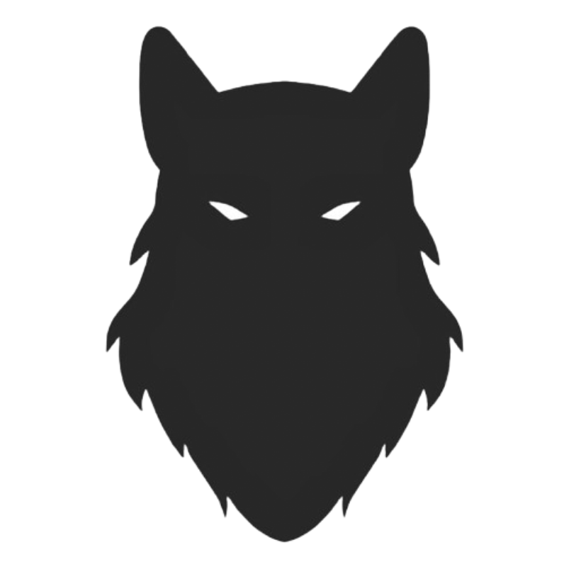

# Romulus
Cryptographically strong password generator web extension.

---

### Load an unpacked extension in Chrome
1. Go to `chrome://extensions` in a new tab, or click `Extensions` -> `Manage extensions`
2. Enable developer mode by toggling the switch
3. Clone Romulus repository
4. Click `Load unpacked` button and select Romulus directory
